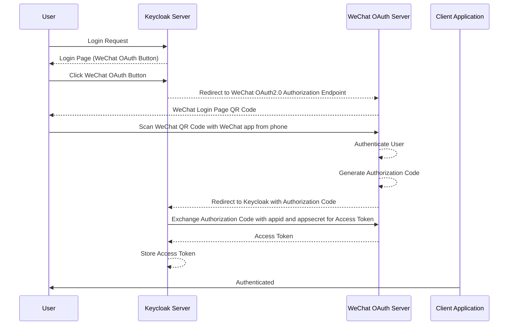
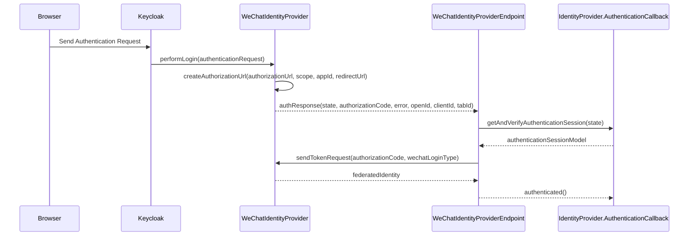

## Sequence diagram of how to obtain Access_token:

```mermaid
sequenceDiagram
participant User
participant Keycloak Server
participant WeChat OAuth Server
participant Client Application
        
    User->>Keycloak Server: Login Request
    Keycloak Server-->>User: Login Page (WeChat OAuth Button)
    User->>Keycloak Server: Click WeChat OAuth Button
    Keycloak Server-->>WeChat OAuth Server: Redirect to WeChat OAuth2.0 Authorization Endpoint
    WeChat OAuth Server-->>User: WeChat Login Page QR Code
    User->>WeChat OAuth Server: Scan WeChat QR Code with WeChat app from phone
    WeChat OAuth Server-->>WeChat OAuth Server: Authenticate User
    WeChat OAuth Server-->>WeChat OAuth Server: Generate Authorization Code
    WeChat OAuth Server-->>Keycloak Server: Redirect to Keycloak with Authorization Code
    Keycloak Server->>WeChat OAuth Server: Exchange Authorization Code with appid and appsecret for Access Token
    WeChat OAuth Server-->>Keycloak Server: Access Token
    Keycloak Server-->>Keycloak Server: Store Access Token
    Client Application->>User: Authenticated
```

## Class sequence diagram of how to obtain Access_token:

```mermaid
sequenceDiagram
    participant Browser
    participant Keycloak
    participant WeChatIdentityProvider
    participant WeChatIdentityProviderEndpoint

    Browser ->> Keycloak: Send Authentication Request
    Keycloak ->> WeChatIdentityProvider: performLogin(authenticationRequest)
    WeChatIdentityProvider ->> WeChatIdentityProvider: createAuthorizationUrl(authorizationUrl, scope, appId, redirectUrl)
    WeChatIdentityProvider -->> WeChatIdentityProviderEndpoint: authResponse(state, authorizationCode, error, openId, clientId, tabId)
    WeChatIdentityProviderEndpoint ->> IdentityProvider.AuthenticationCallback: getAndVerifyAuthenticationSession(state)
    IdentityProvider.AuthenticationCallback -->> WeChatIdentityProviderEndpoint: authenticationSessionModel
    WeChatIdentityProviderEndpoint ->> WeChatIdentityProvider: sendTokenRequest(authorizationCode, wechatLoginType)
    WeChatIdentityProvider -->> WeChatIdentityProviderEndpoint: federatedIdentity
    WeChatIdentityProviderEndpoint -->> IdentityProvider.AuthenticationCallback: authenticated()
```