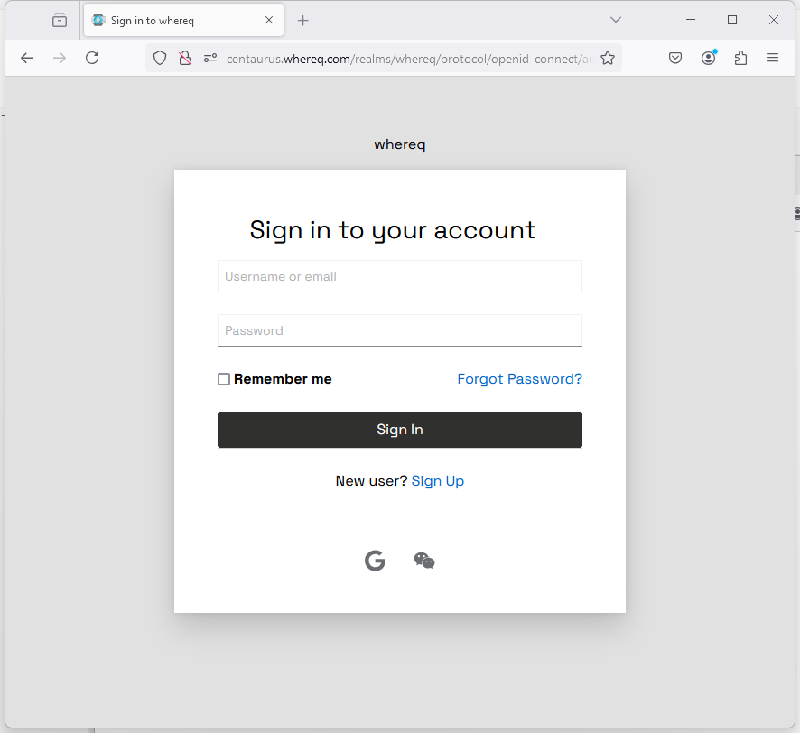
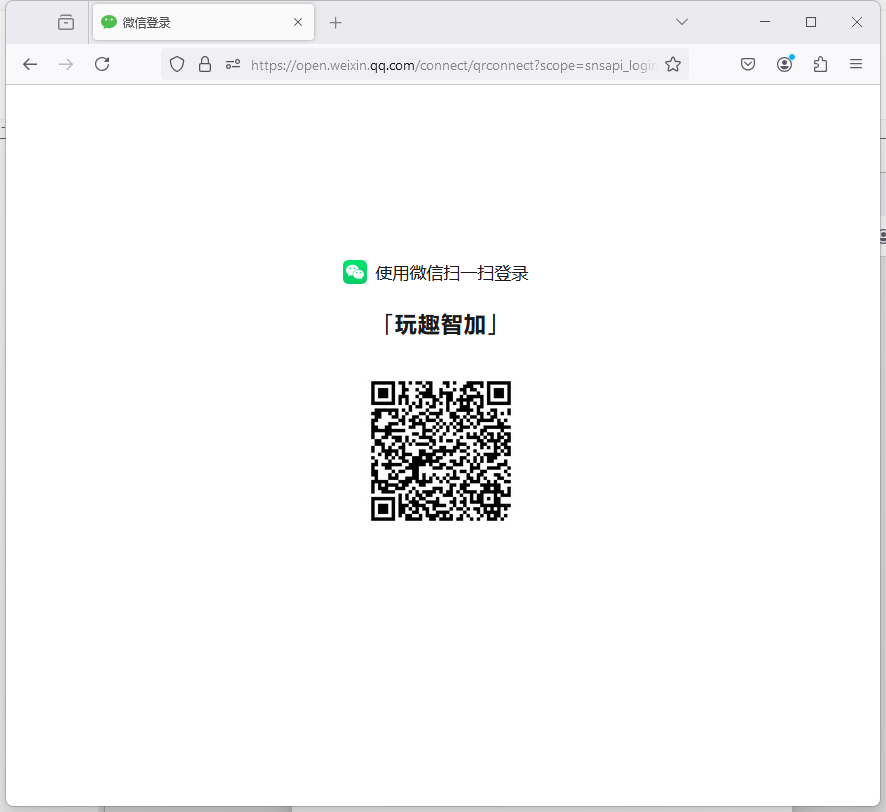
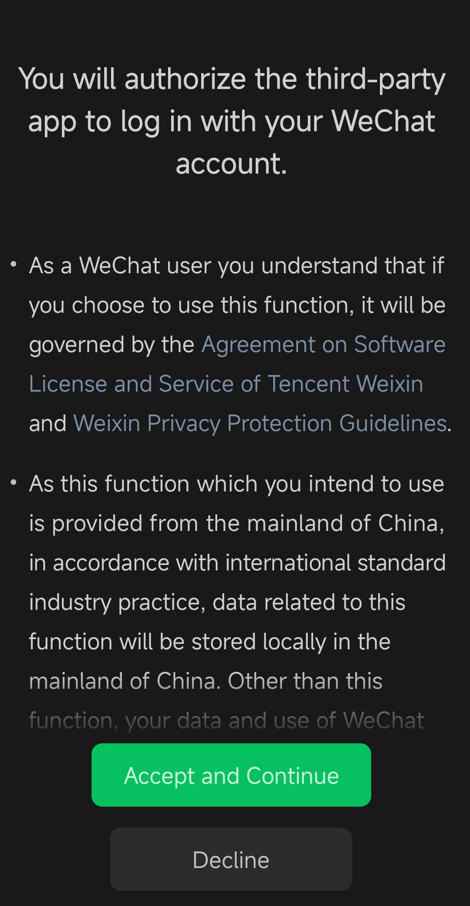
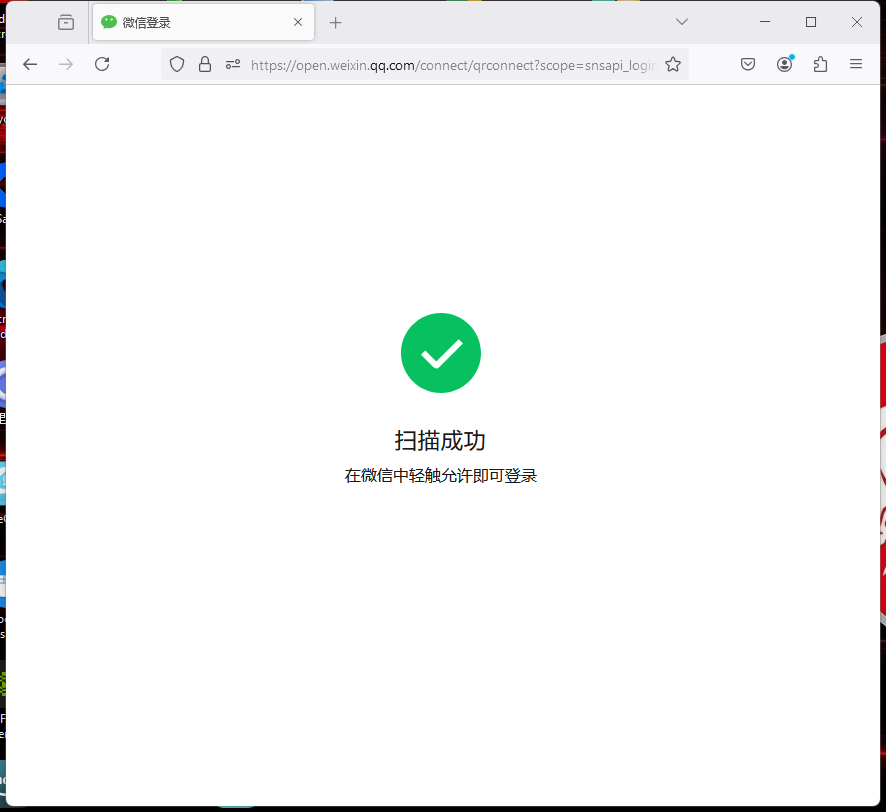
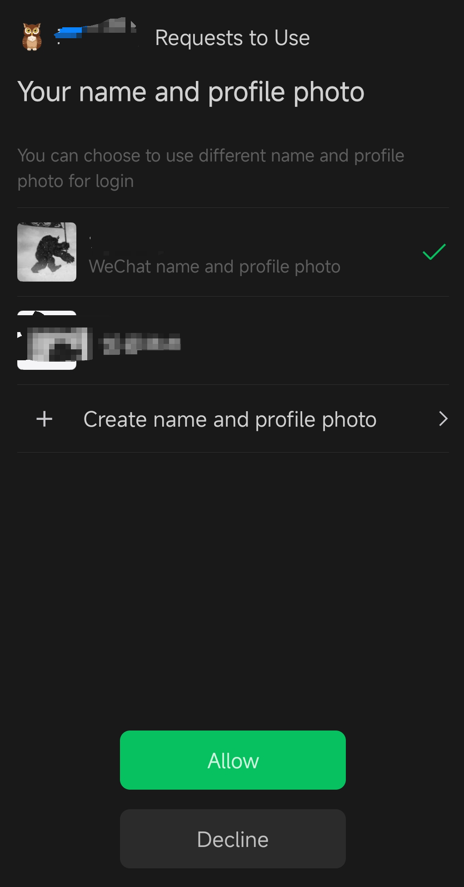

### Steps to Sign In to WeChat via Keycloak
1. **Access the Sign-In Page**
    - Navigate to the sign-in page of the application.
    - You will see a "Sign In" button similar to the image below.

2. **Choose "Sign In with WeChat"**
    - From the options available, select "Sign In with WeChat."

3. **Scan QR Code in WeChat**
    - A QR code will appear on your screen. Open your WeChat app and use the scan feature to scan the QR code.

4. **Accept the Login Request in WeChat**
    - After scanning, a confirmation request will appear in your WeChat app. Accept the request to proceed with the login process.

5. **Authorize the Application**
    - Once you accept, the app will ask you to authorize the connection. Tap "Authorize" to grant the necessary permissions.

6. **Complete Login**
    - After authorization, the login process will complete, and you will be signed in to the application via WeChat.

For a visual walkthrough, check out the video demonstration [here](../../misc/videos/KeyToMarvel.com-KeyCloak-WeChat-QR-Code-Scan-Login.mp4).
