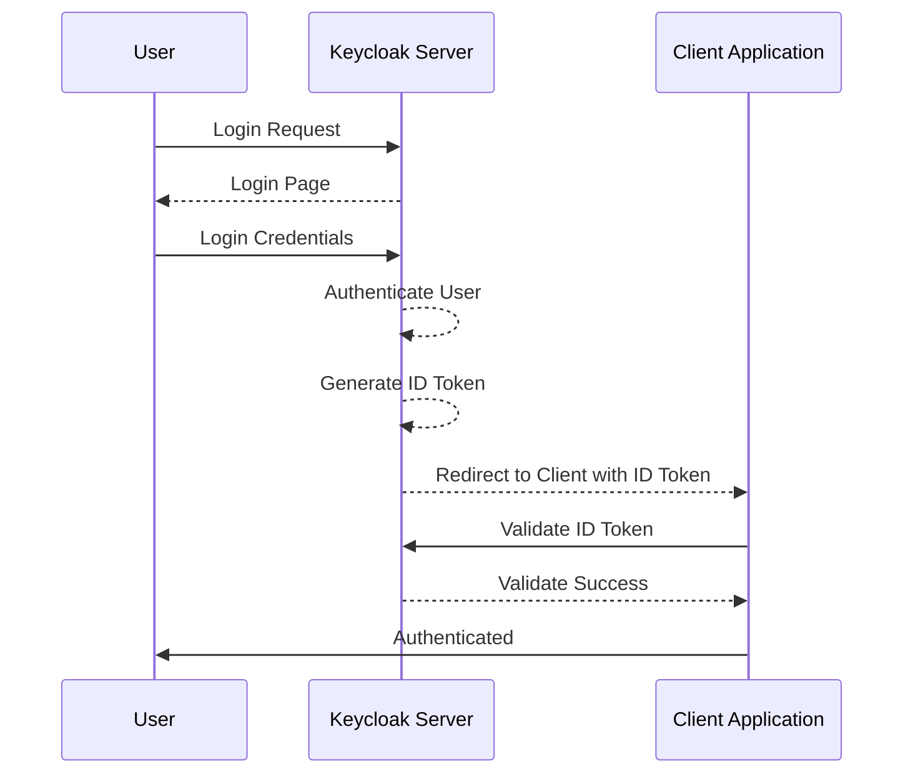

## Keycloak authentication sequence diagram 

```mermaid
sequenceDiagram
participant User
participant Keycloak Server
participant Client Application

    User->>Keycloak Server: Login Request
    Keycloak Server-->>User: Login Page
    User->>Keycloak Server: Login Credentials
    Keycloak Server-->>Keycloak Server: Authenticate User
    Keycloak Server-->>Keycloak Server: Generate ID Token
    Keycloak Server-->>Client Application: Redirect to Client with ID Token
    Client Application->>Keycloak Server: Validate ID Token
    Keycloak Server-->>Client Application: Validate Success
    Client Application->>User: Authenticated
```